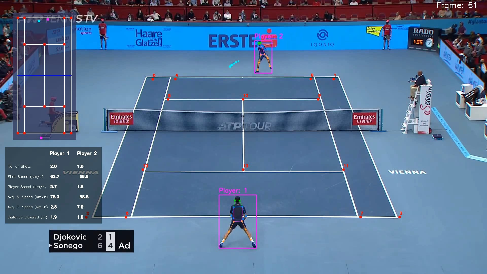
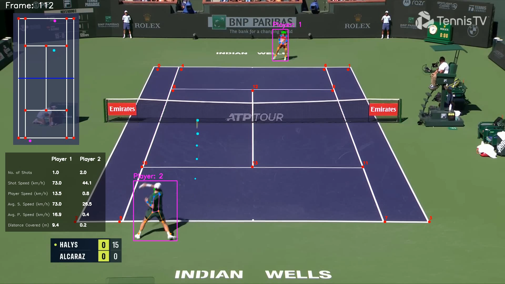
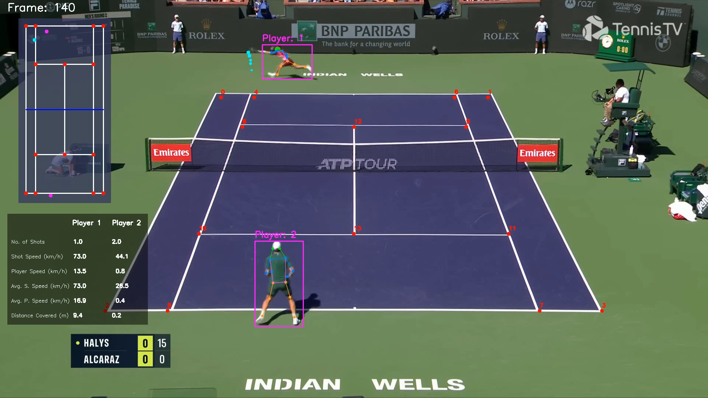
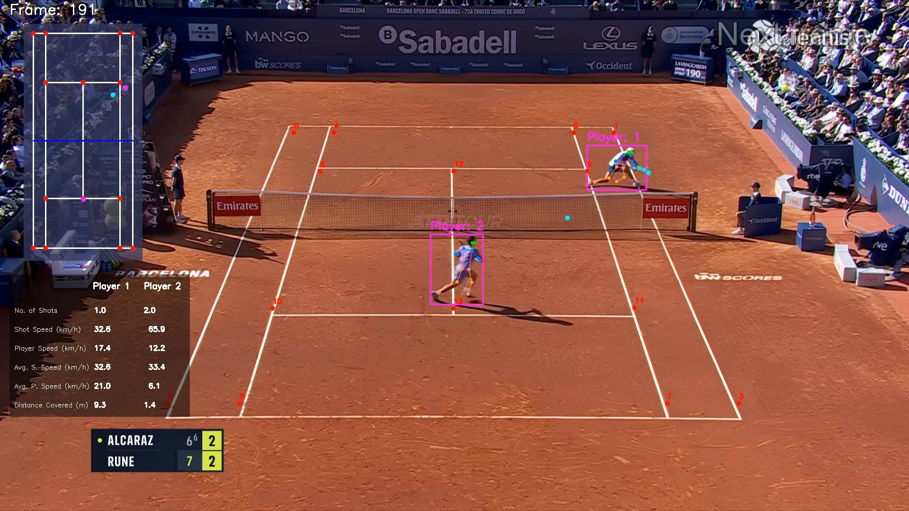

# Tennis Analysis

## Introduction

This project analyzes Tennis players in a video to measure their speed, ball shot speed and number of shots. This
project will detect players and the tennis ball using YOLO and also utilizes CNNs to extract court keypoints.

## Output Videos

## Models Used

* YOLO v8 for player detection
* TrackNet model for ball detection
* Court Key point extraction
* Trained tennis court key point
  [model](https://drive.google.com/file/d/1QrTOF1ToQ4plsSZbkBs3zOLkVt3MBlta/view?usp=sharing)

## Training

* Tennis court keypoint with Pytorch: training/tennis_court_keypoints_training.ipynb

## Requirements

* Python 3.8
* PyTorch 2.4.1+cu118
* Ultralytics
* Pandas
* Numpy
* OpenCV